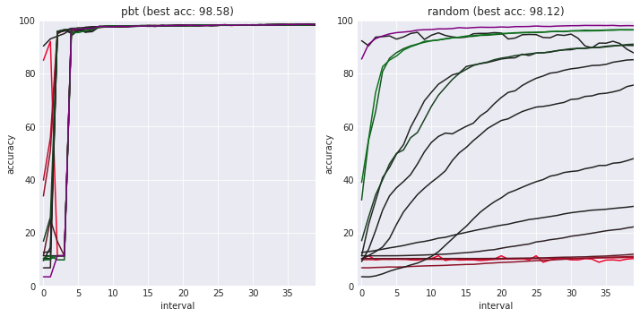
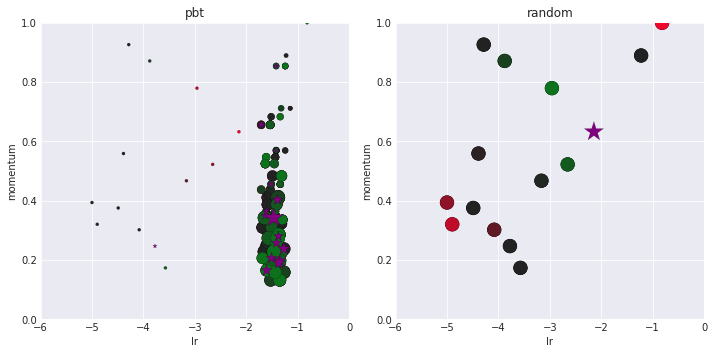

# Caution: Work In Progress.

# This README is merely a draft and placeholder

---

### PBT: Population Based Training

[Population Based Training of Neural Networks, Jaderberg et al](https://arxiv.org/abs/1711.09846)

This repo compares PBT to random search on MNIST.

In this experiment, PBT and random search are given a copy of an initial population of models. This means the initial parameters and hyperparameters are the same between copies of the population (but different between models within the population). PBT and random search each do their best to develop their copy of the models. When they're finished, the best model from each is compared.

Random search simply trains each model in its copy of the population to completion, given its initial parameters and hyperparameters.

PBT trains each model partially and assesses them on the validation set. It then transfers the parameters and hyperparameters from the top performing models to the bottom performing models (exploitation). After transferring the hyperparameters, PBT perturbs them (exploration). Each model is then trained some more, and the process repeats. This allows PBT to learn a hyperparameter schedule instead of only a fixed hyperparameter configuration. PBT can be used with different selection methods (i.e. different ways of defining "top" and "bottom" (e.g. top 5, top 5%, etc.)).

Hyperparameter space:
- Learning rate:
    - Range: 10-5 to 100
    - Scale: Log base 10
- Momentum factor:
    - Range: 0.1 to .9999
    - Scale: Linear

Model:
- [The simple conv net from the PyTorch MNIST example](https://github.com/pytorch/examples/blob/master/mnist/main.py#L52)

Experiment settings:
- Population size: 15
- Epochs: 10
- Batch size: 64
- Partial training set size: 48,000
- Validation set size: 12,000
- Full training set size: 60,000
- Test set size: 10,000

Methodology:
- Goal: Don't let the hyperparameter optimization algorithms see the test set.
- Approach: Train each model on the partial training set. Assess it and its hyperparameters with the validation set. Repeat until the hyperparameter optimization processes are done. Then, reset the best performing model to its initialization and train it on the full training set, using the best found hyperparameter configuration or schedule. Finally, assess it on the test set. Repeat this process with different seeds and report the mean difference in performance between the algorithms, along with the variance.

PBT settings
- Exploitation interval: 0.5 epochs
- Selection method: (Various. See results section.)
- Perturbation factors: [1.2, 0.8]
- Perturbation operation: Multiplication

### Results

Accuracy plots: The best model is shown in purple.

Hyperparameter scatter plots: The size of the dots grow as the models train. The hyperparameter configurations of the best model from each population are purple stars.

#### Selection method: Exploit best model

Exploit best model: For each model, except the best model, transfer the best model's parameters and hyperparameters to it.

#### Selection method: Truncation selection

Truncation selection: For each model in the bottom 20% of performance, sample a model from the top 20% and transfer its parameters and hyperparameters to the worse model. One can think of the models in the bottom 20% as being **truncated** during each exploitation step. Leave the top 80% unchanged.

### Request to readers and users

If you notice a flaw in the experiment design or code, please say so in an issue and consider creating a pull request.

In general, pull requests, questions, and suggestions are welcome in the issues section.

### Details

Model definition

Trainer definition

Experimenter definition

Run

Plot

### Acknowledgements

This repo is inspired by [bkj's pbt repo](https://github.com/bkj/pbt), where they replicated figure 2 of the paper. Figure 2 gives intuition for how PBT works, and is generated from a toy problem. This repo is not a fork so that it shows up in github search results.
